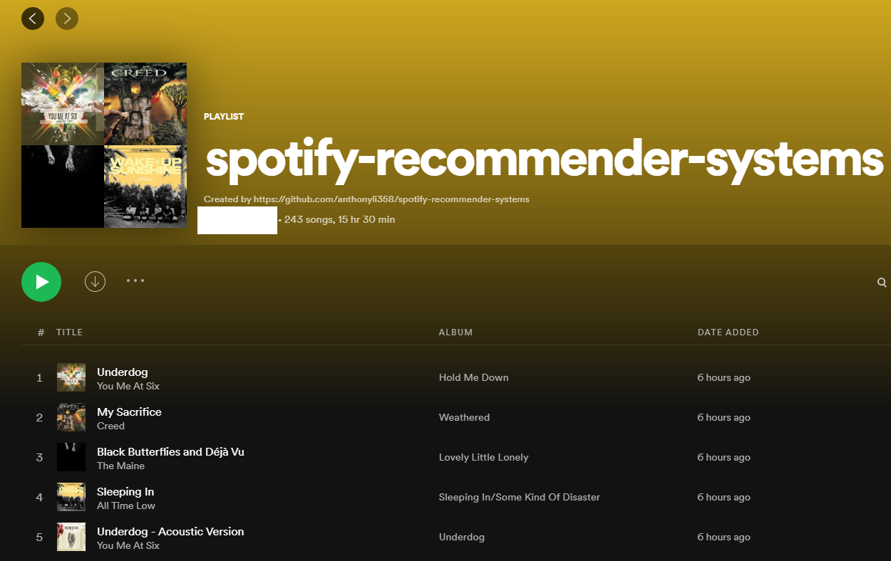
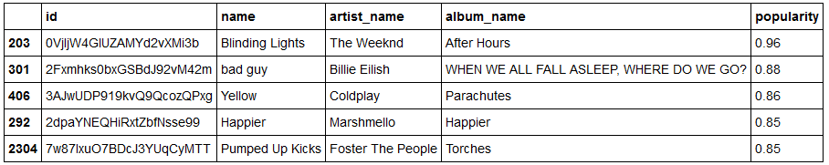
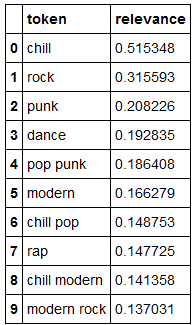
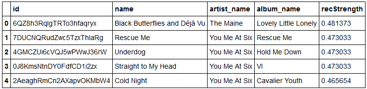
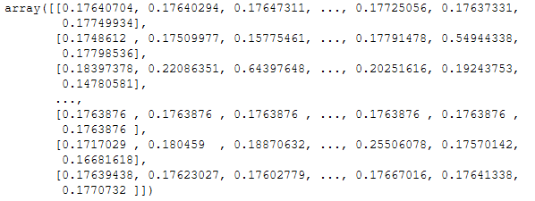
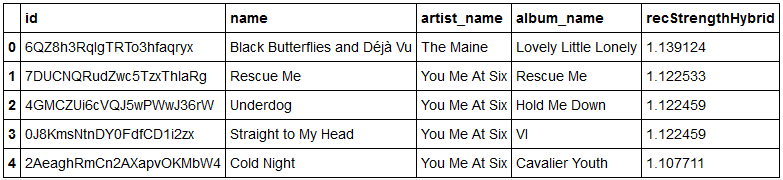
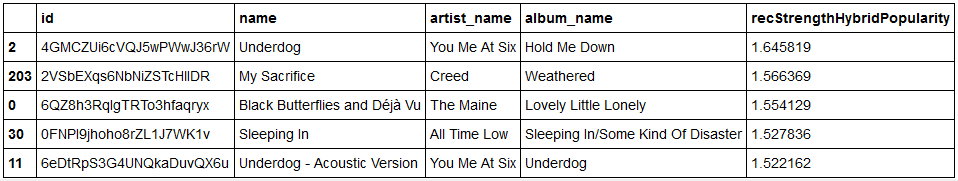

# spotify-recommender-systems
Exploration implementing [recommender systems](https://en.wikipedia.org/wiki/Recommender_system) using 
[Spotify data](https://developer.spotify.com/documentation/web-api/).

<p align="left">
      
</p>

## Results

In [recommender_playlists.ipynb](recommender_playlists.ipynb), traditional machine learning (ML) methods 
are applied to yield recommendations based on a set of favourite playlists. In this classification the 
[sci-kit learn](https://scikit-learn.org/stable/) implementations of 
[logistic regression](https://scikit-learn.org/stable/modules/generated/sklearn.linear_model.LogisticRegression.html) and 
[random forest](https://en.wikipedia.org/wiki/Random_forest) are used alongside [xgboost](https://xgboost.readthedocs.io/en/latest/)
to classify if a track should be considered to be added to the set of favourite playlists.

Although the traditional approach can yield good recommendations, it is heavily reliant on both feature engineering 
and there being enough features which cover user tastes (which is unlikely for subjective items such as movies and songs).
As this approach reliant on users define their favourites (classification) or to accurately score songs 
(regression), it suffers from both mislabelling inaccuracies and the cold-start problem when a user has a fresh account 
or doesn't provide any ratings. Hence recommender system approaches are applied in [recommender_systems.ipynb](recommender_systems.ipynb).

### Model Evaluation Metric

Here we use the Top-N accuracy metric (in this case Top-100), which applies a recommender system to a dataset of 1 user 
interacted item and 100 uninteracted items. The perfect recommender system will rank the user interacted item first 
(highest recommendation strength). This is computed for each item for each user, and then the weighted mean is taken
across all users to get a global metric. The metric 'recall@5' for each user is the number of times the interacted item
was in the Top-5 items / the number of times it wasn't.

### Popularity Recommender

A popularity recommender recommends songs ranked by their popularity regardless of user's preferences. This is of course
dependent upon the methodology used to determine the popularity metric (usually some function of time, user interactions,
and user ratings).

```'recall@5': 0.09318497913769123, 'recall@10': 0.17385257301808066```

<p align="left">
      
</p>

As it doesn't take user activity into account, solely recommending by popularity is a poor way to 
recommend tracks. However, as we will see later it is a good method to mix in for variety and to avoid the cold-start problem.

### Content-based Recommender

A content-based recommender leverages attributes from items the user has interacted with to recommend similar items. 
Here the popular [TF-IDF](https://en.wikipedia.org/wiki/Tf%E2%80%93idf) method is used to convert unstructured text 
(unigrams and bigrams of genres and song/artist/album/playlist name) into a sparse matrix , 
which is then summed and normalized across users to give a vector structure, where each word is represented
by a position in the vector and the value measures its relevance. The cosine similarity between the 
user vector and the initial matrix (all users) then gives a metric to recommend new tracks.

<p align="left">
      
</p>

```'recall@5': 0.9123783031988874, 'recall@10': 0.972183588317107```

<p align="left">
      
</p>

A very high recall is observed as the dataset used considers each playlist (which tend to be heavily genre/mood based)
as a user. Hence the content-based recommender performs exceedingly well by the Top-N metric but fails to give much variety.

### Collaborative Recommender

A collaborative recommender can be either memory-based (based on past user interactions) or model-based (e.g. clustering).
Here [matrix factorisation](https://en.wikipedia.org/wiki/Matrix_factorization_(recommender_systems)) implemented
via [singular value decomposition (SVD)](https://en.wikipedia.org/wiki/Singular_value_decomposition) is used to compress
a user-item matrix into a low-dimensional representation. This yields better scalability and better generalisation.
The items x users matrix is then used to recommend items to users based on similar user interactions.

<p align="left">
      
</p>

```'recall@5': 0.23783031988873435, 'recall@10': 0.30737134909596664```

<p align="left">
      
</p>

The collaborative approach outperforms the popularity approach but is not a good as the content-based approach. It can 
suffer from the sparsity problem if the user set is too small or the number of interactions is too low.

### Hybrid Recommender

A hybrid recommender combines the content-based and collaborative approaches and has been shown to perform better in 
many studies. It avoids high variance and enables variety and weighting (e.g. genre weighting). As the content-based
approach performs better by the Top-N metric is is weighed more strongly here.

```'recall@5': 0.9068150208623088, 'recall@10': 0.9666203059805285```

<p align="left">
      
</p>

This weighting approach has the same issue as the content-based recommender - too much weighting on genre and not
enough variety. Here the popularity approach is also now incorporated with a weighting to give a hybrid + popularity recommender. 

```'recall@5': 0.6244784422809457, 'recall@10': 0.7343532684283728```

<p align="left">
      
</p>

Even though it has a lower recall, subjectively this recommender appears to give the best recommendations in practice.
It may therefore be better to incorporate other evaluation metrics such as one that measures variety, 
or increase the scope of this dataset as its current playlist based approach means that pure genre-based 
recommendations perform the best.

### Future Work

- Expand the dataset to include other users (rather than proxying playlists as users)
- Develop other evaluation metrics (although this is somewhat solved by expanding the dataset)

## Getting Started

1. Access the [Spotify API](https://developer.spotify.com/)
2. Setup your project including the project settings (I used http://localhost:9001/callback as the redirect URI)
3. Create the [spotify/spotify_details.yml]([spotify/spotify_details.yml]) yaml with the Spotify APi client_id, 
client_secret, and redirect_uri
4. Run [music_data.py](music_data.py) to pull Spotify data to local pandas dataframes
5. Explore the traditional ML implementations in [recommender_playlists.ipynb](recommender_playlists.ipynb) and recommender system
implementations in [recommender_systems.ipynb](recommender_systems.ipynb)
6. Enjoy the resulting playlists!

## Development

Modules:
- [music_data.py](music_data.py): Script file for pulling Spotify music data
- [data_functions.py](data_functions.py): Helper functions for pulling Spotify music data
- [recommender_playlists.ipynb](recommender_playlists.ipynb): Jupyter notebook to recommend tracks based on traditional
ML techniques
- [recommender_systems.ipynb](recommender_systems.ipynb): Jupyter notebook to recommend tracks using implementation and evaluation
 of popularity, content-based, collaborative, and hybrid recommendation system approaches. Made with reference to
 [recommender-systems-in-python-101 on Kaggle](https://www.kaggle.com/gspmoreira/recommender-systems-in-python-101/notebook)

The gitignore'd 'spotify' folder contains locally saved pandas dataframes from [music_data.py](music_data.py) as well as 
Spotify API details [spotify/spotify_details.yml]([spotify/spotify_details.yml]) and playlist ids 
[spotify/playlists.yml]([spotify/playlists.yml]) 

## Resources

- [spotipy](https://spotipy.readthedocs.io/) has a repo of examples [available on GitHub](https://github.com/plamere/spotipy/tree/master/examples)
- [Spotify for Developers](https://developer.spotify.com/) has a [dashboard](https://developer.spotify.com/dashboard/applications)
to manage your project as well as [development guides](https://developer.spotify.com/documentation/general/guides/)
and an [API reference guide](https://developer.spotify.com/documentation/web-api/reference/)
